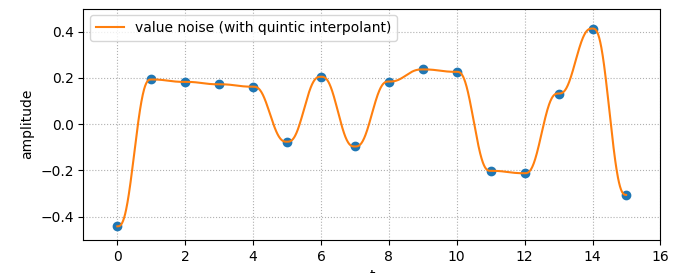
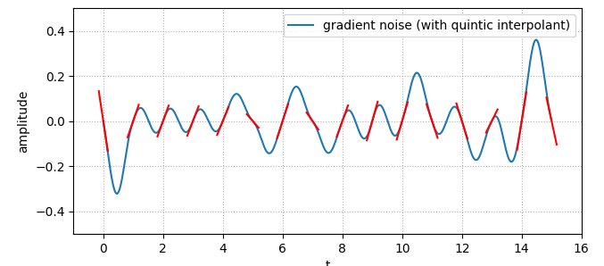
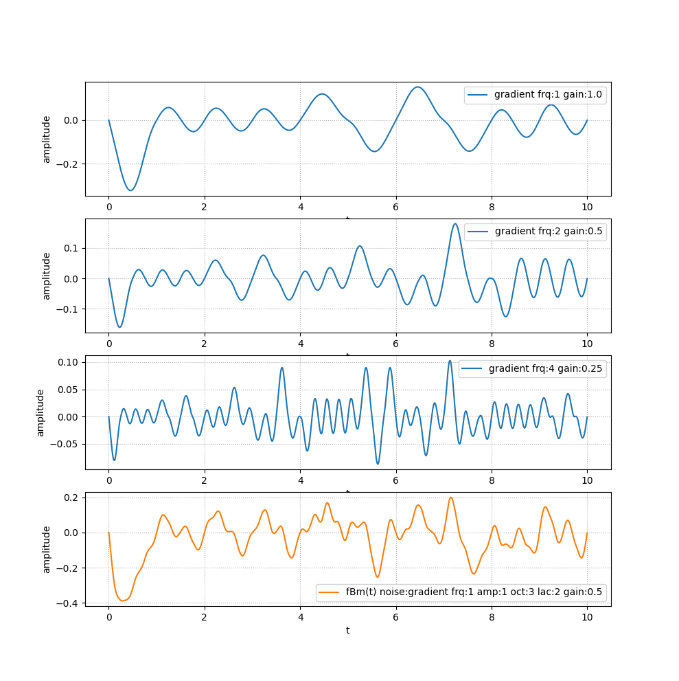

# How the Noise node works

The `Noise` node works like other `Uniform` based nodes: it produces a
deterministic single value according to the time, which can be used in a
shader. In the case of the `Noise`, the shader obtains a `float` sample
corresponding to a noise signal at a given time `t`.

The node itself can not be used to create advanced patterns/fractals or even
display a waveform within a shader because there is only one random value at a
given time. On the other hand, it can typically be used to "wiggle" an object
or a parameter.

This mechanism could be implemented fully in GPU, but a GPU [PRNG][prng] can be
costly and hardly shared between pipelines. Having the `Noise` CPU side allows
a fast random generation as well as sharing the signal between different
branches. It gives shader a simple and efficient source of noise that can be
used in various creative situations.

## Algorithm

### Random source

At the most elementary level, we generate random values. The PRNG we use is one
of the [Xorshift][xorshift] converted to a float between `0.0` and `1.0`.  For
a given integer, we will always provide the same float value.

### Random signal

Using these random values as "key frames" and interpolating between them would
give us a **Value Noise**, as illustrated below:

The patterns generated in such a way are not desirable due to the variation in
frequencies: when points are close the frequency is low, and can suddenly
fluctuates. So instead of using the random values as the noise signal itself,
we interpret them as gradient: this is the **Gradient Noise**, used in the
popular [Perlin Noise][perlin-noise]. In our case, since we use a 1D signal, it
looks like the following:

Random values of `0` and `1` respectively correspond to a tilt of `-45°`
(`-π/4`) and `45°` (`π/4`).

For a given time value `t` between 2 gradients, we obtain two y-axis
coordinates by prolonging the line of each of these gradients. The signal value
at `t` lies between these 2 points. Using the x-axis distance from `t` to each
lattice (where the gradients are located), we use a non-linear interpolation to
get the finale value.

### Interpolants

The two common interpolation functions are:

1. the [Cubic Hermite curve][hermite], `f(t)=3t²-2t³` (typically used in GLSL
   `smoothstep()`) initially used by Ken Perlin in his first Perlin Noise
   implementation
2. the more modern (and complex) quintic curve `f(t)=6t⁵-15t⁴+10t³` introduced
   in 2002 by Ken Perlin in his proposed improved version of the Perlin Noise,
   in order to address discontinuities in the 2nd order derivatives `f"(t)`.

Both functions are available in the `Noise.interpolant` parameter, along with a
linear interpolation `f(t)=t` which can be used for debugging purpose. It is
not recommended to use that one for another purpose because it will cause an
undesired output (flat curve) if the gradients are oriented the same.

### Accumulation

The finale noise is generated using a form of [fractional Brownian
motion][fbm], which basically means multiple layers of gradient noise are
added together to create a refined pattern. The parameter controlling the
number of layers accumulated is `Noise.octaves`.

With the standard parameters, each octave will see its frequency double
(`Noise.lacunarity=2`) and its amplitude halved (`Noise.gain=½`) from the
previous one.  The gain is also known as *persistence*, and in its mathematical
form derived from the [Hurst exponent][hurst]. This gain/persistence/Hurst
notion refers to the same thing, which is the "memory" between octaves, or
self-similarity.

[prng]: https://en.wikipedia.org/wiki/Pseudo-random_number_generator
[xorshift]: https://en.wikipedia.org/wiki/Xorshift
[perlin-noise]: https://en.wikipedia.org/wiki/Perlin_noise
[hermite]: https://en.wikipedia.org/wiki/Hermite_curve
[fbm]: https://en.wikipedia.org/wiki/Fractional_Brownian_motion
[hurst]: https://en.wikipedia.org/wiki/Hurst_exponent
